# 🌐 Professional Network - LinkedIn Clone

> A modern, full-stack social networking platform designed for professional connections and career growth.

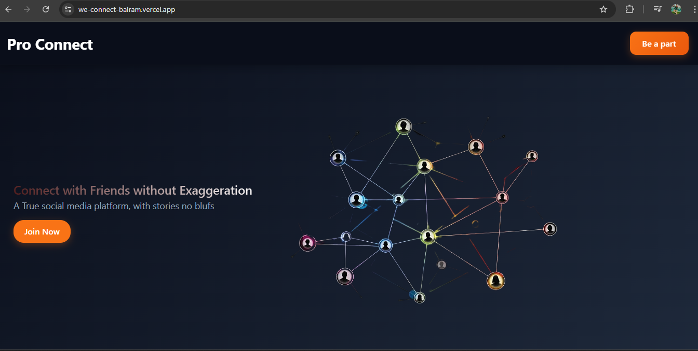

## 📋 Table of Contents

- [Overview](#overview)
- [Features](#features)
- [Tech Stack](#tech-stack)
- [Screenshots](#screenshots)
- [Installation](#installation)
- [Usage](#usage)
- [API Documentation](#api-documentation)
- [Contributing](#contributing)
- [License](#license)

## 🚀 Overview

This project is a professional networking platform inspired by LinkedIn, built with modern web technologies. It enables users to connect professionally, share career updates, showcase work experience, and build meaningful professional relationships.

**Live Demo:** [Coming Soon]

## ✨ Features

### Core Functionality
- 📝 **Create & Share Posts** - Share professional updates with your network
- 🖼️ **Image Uploads** - Add images to posts (50KB limit for cloud storage optimization)
- 💬 **Interactive Comments** - Engage with posts through comments
- ❤️ **Like System** - Show appreciation for posts
- 🔄 **Share Posts** - Amplify content across your network
- 🗑️ **Content Management** - and delete your posts

### Profile & Professional Features
- 👤 **Complete Profile Management** - Comprehensive profile customization
- 💼 **Work Experience** - Showcase your professional journey
- 🔍 **User Discovery** - Find and explore other professionals
- 👀 **Profile Viewing** - Browse detailed user profiles
- 🤝 **Connection System** - Send and manage connection requests
- ✅ **Request Management** - Accept connection requests
- 📄 **Resume Download** - Generate and download professional resumes

### User Experience
- 📱 **Responsive Design** - Seamless experience across all devices
- 🔐 **Secure Authentication** - Safe login and registration system
- 🌟 **Intuitive Interface** - Clean, professional user interface

## 🛠️ Tech Stack

### Frontend
- **Framework:** Next.js 15.3.4
- **Library:** React 19.0.0
- **State Management:** Redux Toolkit 2.8.2
- **HTTP Client:** Axios 1.10.0
- **Styling:** CSS Modules / Tailwind CSS

### Backend
- **Runtime:** Node.js
- **Framework:** Express.js 5.1.0
- **Database:** MongoDB with Mongoose 8.16.1
- **Authentication:** bcrypt 6.0.0
- **File Upload:** Multer 2.0.1
- **PDF Generation:** PDF Creator Node 2.3.5, PDFKit 0.17.1

### Development Tools
- **Development Server:** Nodemon 3.1.10
- **Environment Variables:** dotenv 17.0.0
- **Cross-Origin Requests:** CORS 2.8.5
- **Code Quality:** ESLint 9

## 📱 Screenshots

### Desktop Views

#### Home Page

*Clean, professional home feed with post interactions*

#### Login Page
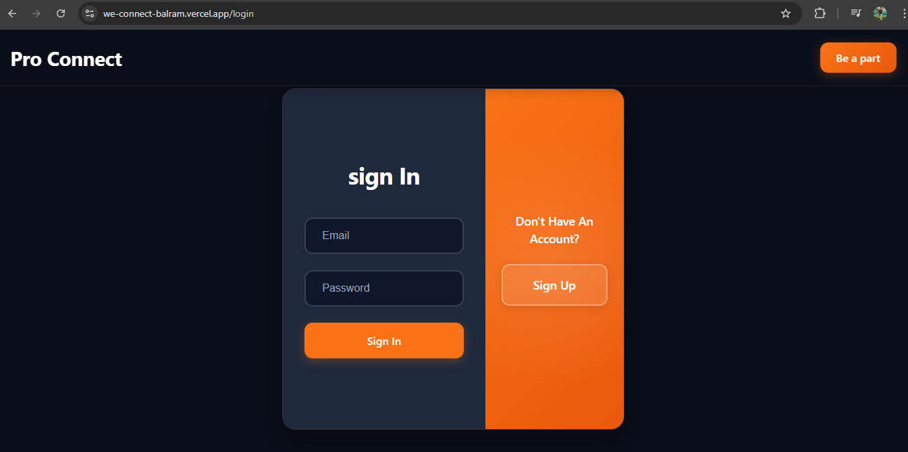
*Secure authentication with modern design*

#### Registration Page
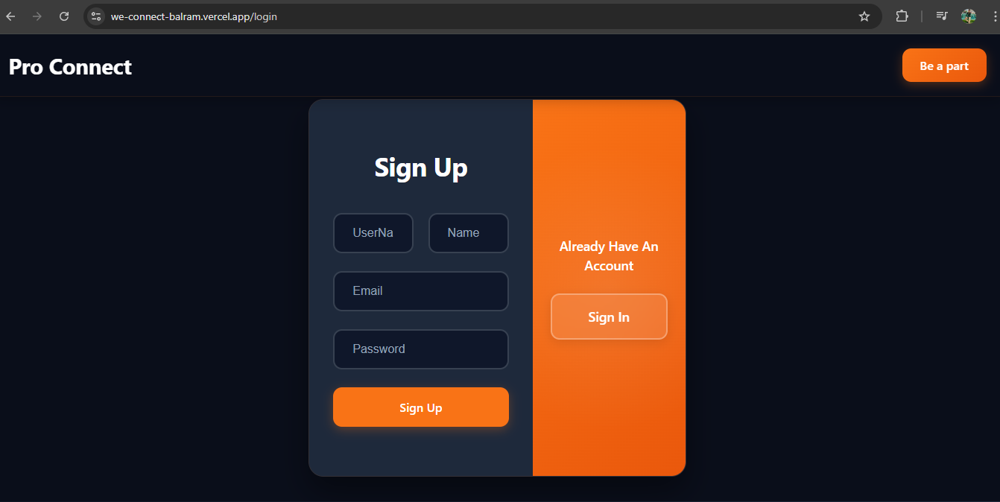
*Streamlined signup process*

#### Dashboard
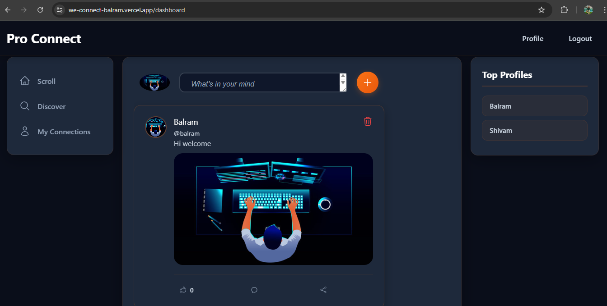
*Comprehensive overview of your professional network*

#### Profile Page
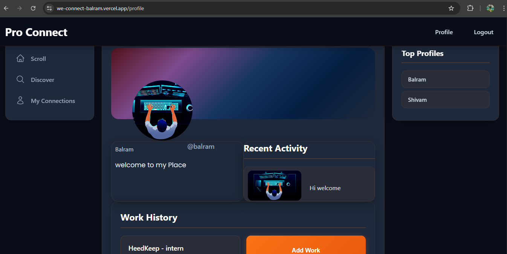
*Complete professional profile showcase*

#### Discover Users
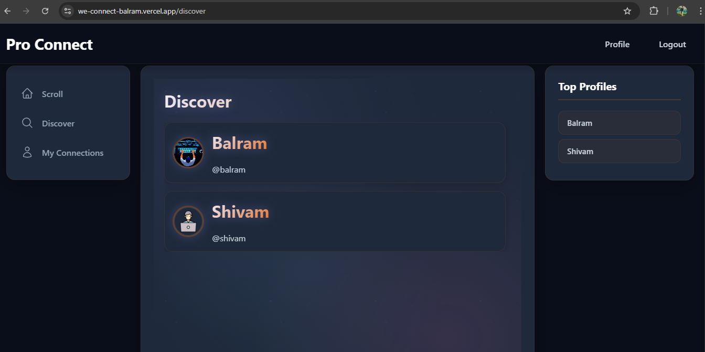
*Find and connect with professionals*

#### View Profile
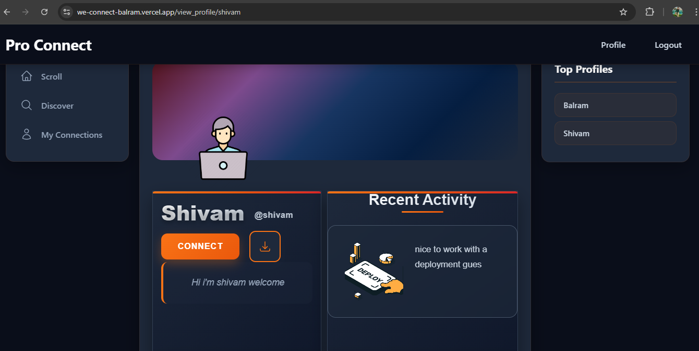
*Detailed view of other users' profiles*

#### My Connections
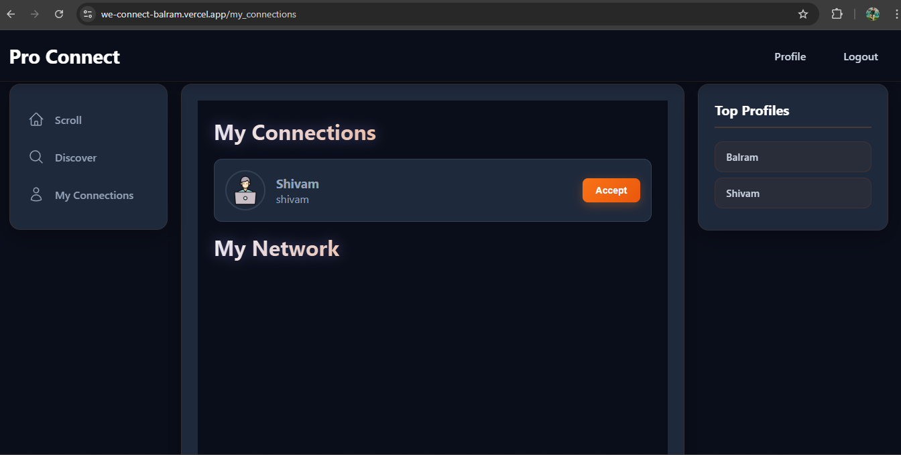
*Manage your professional network*

### Mobile Views

#### Home Page - Mobile
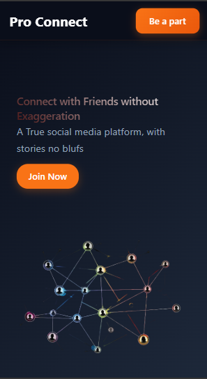
*Optimized mobile experience*

#### Login - Mobile
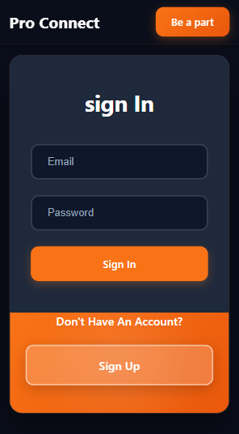
*Touch-friendly authentication*

#### Registration - Mobile
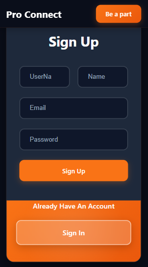
*Mobile-optimized signup*

#### Dashboard - Mobile
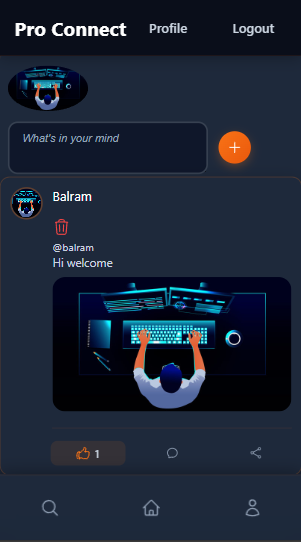
*Mobile dashboard experience*

#### Profile - Mobile
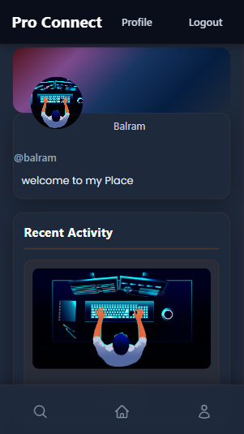
*Mobile profile management*

#### Discover - Mobile
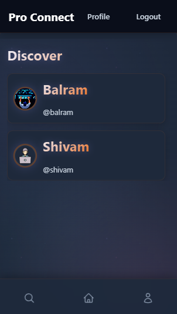
*Mobile user discovery*

#### View Profile - Mobile
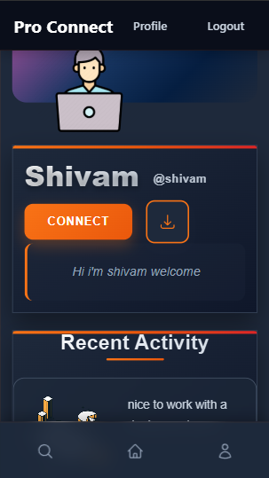
*Mobile profile viewing*

#### Connections - Mobile
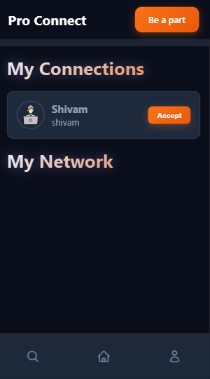
*Mobile connection management*

## 🚀 Installation

### Prerequisites
- Node.js (v16 or higher)
- MongoDB
- npm or yarn

### Backend Setup

```bash
# Clone the repository
git clone [your-repo-url]
cd professional-network

# Navigate to backend directory
cd backend

# Install dependencies
npm install

# Create environment variables
cp .env.example .env
# Configure your MongoDB URI and other variables

# Start development server
npm run dev
```

### Frontend Setup

```bash
# Navigate to frontend directory
cd frontend

# Install dependencies
npm install

# Start development server
npm run dev
```

## 💻 Usage

1. **Start the Backend Server:**
   ```bash
   cd backend && npm run dev
   ```

2. **Start the Frontend Application:**
   ```bash
   cd frontend && npm run dev
   ```

3. **Access the Application:**
   - Frontend: `http://localhost:3000`
   - Backend API: `http://localhost:9090`

## 📚 API Documentation

### Authentication Endpoints
- `POST /api/auth/register` - User registration
- `POST /api/auth/login` - User login
- `GET /api/auth/profile` - Get user profile

### Posts Endpoints
- `GET /api/posts` - Get all posts
- `POST /api/posts` - Create new post
- `PUT /api/posts/:id` - Update post
- `DELETE /api/posts/:id` - Delete post
- `POST /api/posts/:id/like` - Like post
- `POST /api/posts/:id/comment` - Add comment

### Users Endpoints
- `GET /api/users` - Discover users
- `GET /api/users/:id` - Get user profile
- `PUT /api/users/profile` - Update profile
- `POST /api/users/connect/:id` - Send connection request
- `PUT /api/users/accept/:id` - Accept connection request
- `GET /api/users/connections` - Get user connections

### Resume Endpoints
- `GET /api/resume/download/:id` - Download user resume

## 🤝 Contributing

We welcome contributions! Please follow these steps:

1. Fork the repository
2. Create your feature branch (`git checkout -b feature/AmazingFeature`)
3. Commit your changes (`git commit -m 'Add some AmazingFeature'`)
4. Push to the branch (`git push origin feature/AmazingFeature`)
5. Open a Pull Request

### Development Guidelines
- Follow the existing code style
- Write meaningful commit messages
- Add tests for new features
- Update documentation as needed

## 📝 License

This project is licensed under the ISC License - see the [LICENSE](LICENSE) file for details.

## 👨‍💻 Author

**Balram**
- GitHub: [@balram](https://github.com/BalramApply)
- LinkedIn: [Connect with me](https://linkedin.com/in/balram-patel-185aa526a/)

## 🙏 Acknowledgments

- Inspired by LinkedIn's professional networking model
- Built with modern web development best practices
- Thanks to the open-source community for amazing tools and libraries

---

### 📊 Project Stats

- **Frontend Package:** React 19.0.0 + Next.js 15.3.4
- **Backend Package:** Node.js + Express.js 5.1.0
- **Database:** MongoDB with Mongoose
- **Image Limit:** 50KB (Cloud storage optimized)
- **Features:** 13+ Core features implemented

---

**⭐ If you found this project helpful, please give it a star!**